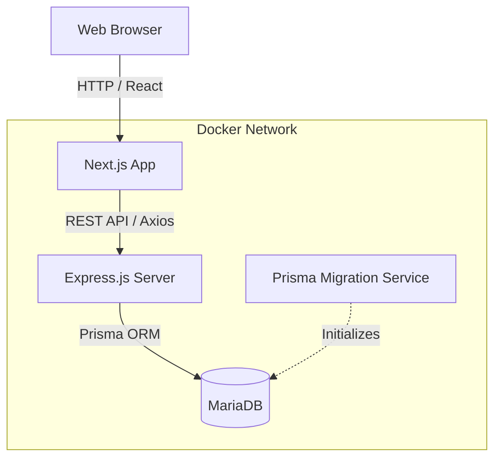

# 📚 LibraFlow


**LibraFlow** is a modern, enterprise-ready Library Management System. Designed for ease of use, maintainability, and scalability, LibraFlow handles the full lifecycle of a digital library, from cataloging books to loan tracking, with an intuitive dashboard and robust backend API.

## 🚀 Live Demo

[Live Demo - *Coming Soon*](#)

## 📖 Overview

LibraFlow simplifies library management through automation, real-time analytics, and clean architectural design. It serves as a full-stack solution suitable for schools, universities, or private libraries, completely containerized for instant deployment.

## ✨ Features

- **RBAC Authentication**: Secure access control for Administrators and Members.
- **Smart Cataloging**: Track books, manage categories, and handle stock dynamically.
- **Loan Management**: End-to-end borrowing workflows (Pending, Approved, Overdue, Returned, Fines).
- **Interactive Dashboards**: Real-time insights and circulation statistics.
- **Automated Reporting**: Export loan history and analytics as PDF reports.
- **Excel Import/Export**: Batch user registration and mass data import.
- **Modern UI**: Dark/Light mode support, built with Tailwind CSS and shadcn/ui.
- **Dockerized**: Fully orchestrated with Docker Compose for production and development.

## 📸 Screenshots

| Landing Page | Admin Dashboard |
|:---:|:---:|
|  |  |

| Book Catalog | Loan Management |
|:---:|:---:|
|  |  |

*(Add screenshots to the `docs/screenshots` folder)*

## 📐 Architecture Diagram



## 📂 Folder Structure

```text
libraflow/
├── backend/            # Express.js REST API
│   ├── prisma/         # Schema, Migrations, and Rich Seeder
│   ├── src/            # Controllers, Routes, Middleware, Utils
│   └── Dockerfile      # Multi-stage production build
├── frontend/           # Next.js 14 Web Application
│   ├── app/            # App router, Pages, Layouts
│   ├── components/     # UI Components (shadcn, radix)
│   └── Dockerfile      # Multi-stage standalone build
├── docs/               # Architecture diagrams and screenshots
└── docker-compose.yml  # Root orchestration
```

## 🛠️ Getting Started

### 🐳 Running with Docker (Recommended)

LibraFlow uses Docker Compose to orchestrate the Database, Backend, Frontend, and Migrations perfectly.

1. **Clone the repository:**
   ```bash
   git clone https://github.com/yourusername/libraflow.git
   cd libraflow
   ```

2. **Configure Environment Variables:**
   ```bash
   cp backend/env.example backend/.env
   cp frontend/env.example frontend/.env
   ```

3. **Start the cluster:**
   ```bash
   docker compose up --build -d
   ```
   *The system will automatically run database migrations before the backend starts.*

4. **Seed the database (Optional but recommended):**
   ```bash
   docker compose exec backend npx prisma db seed
   ```

5. **Access the application:**
   - **Frontend App**: `http://localhost:3000`
   - **Backend API Docs (Swagger)**: `http://localhost:3555/docs`
   - **Backend Health Check**: `http://localhost:3555/health`

### 💻 Running Locally (Without Docker)

<details>
<summary>Click to view local development steps</summary>

1. Ensure MariaDB is running on your machine (e.g., via Laragon or local install).
2. Start the Backend:
   ```bash
   cd backend
   npm install
   cp env.example .env # Update with your local database credentials
   npx prisma migrate dev
   npm run dev
   ```
3. Start the Frontend:
   ```bash
   cd frontend
   npm install
   cp env.example .env
   npm run dev
   ```
</details>

## 🔐 Default Credentials

If you ran the database seeder, the following accounts are available:

- **Admin Account**: `admin@libraflow.dev` / `password123`
- **Member Account**: `member1@libraflow.dev` / `password123`
- **Librarian Account**: `librarian1@libraflow.dev` / `password123`

## 📡 API Overview

A complete, interactive OpenAPI/Swagger specification is available at `GET /docs` once the backend is running.

## 🏗️ Tech Stack

- **Frontend**: Next.js 14, React 19, Tailwind CSS, shadcn/ui, Zustand, React Query
- **Backend**: Node.js, Express.js, TypeScript, Zod, JWT, bcrypt, PDFKit
- **Database**: MariaDB, Prisma ORM
- **DevOps**: Docker, Docker Compose, GitHub Actions, ESLint, Prettier

## 🚀 Deployment

LibraFlow is ready for deployment across modern cloud providers:
- **Backend**: Render, Railway, Fly.io, or VPS via Docker.
- **Frontend**: Vercel, Netlify, or standard Node environments.
- **Database**: PlanetScale, Aiven, or AWS RDS.

## 🗺️ Roadmap & Future Improvements

- [ ] Add GraphQL support for specific querying needs.
- [ ] Implement Redis caching for catalog data.
- [ ] Automated email notifications for overdue books.
- [ ] Support for multiple library branches.


